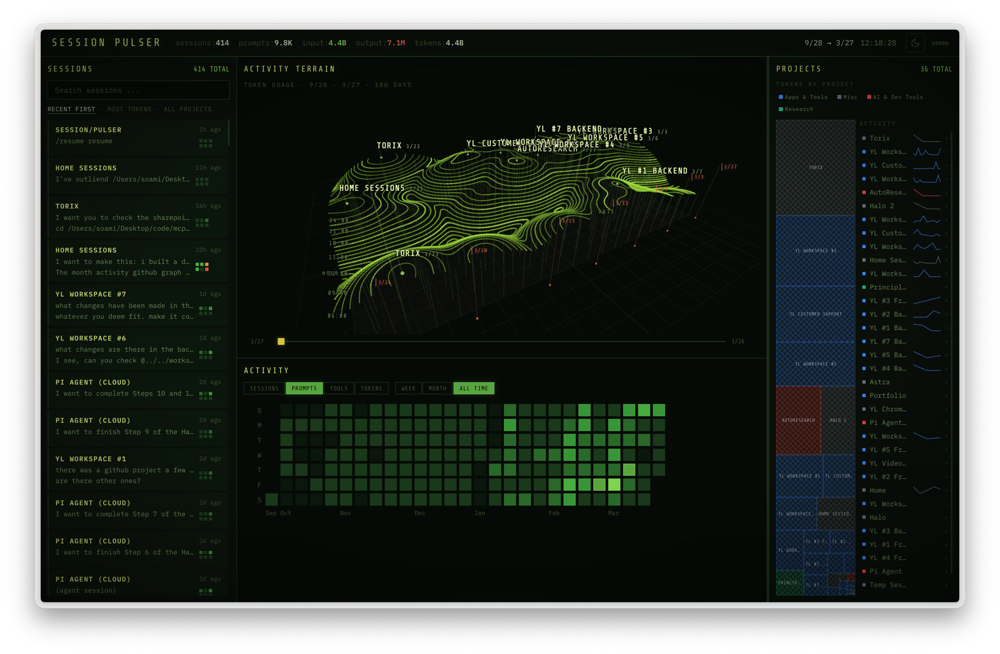

# Session Pulser

A dashboard that visualizes your Claude Code usage — sessions, token consumption, project activity, and more — rendered as an interactive 3D terrain map.



## Features

- **Activity Terrain** — 3D contour map built from a heightfield of token usage (date x hour-of-day), extracted via marching squares
- **Session Browser** — searchable, filterable list of all Claude Code sessions with prompt previews
- **Activity Heatmap** — GitHub-style contribution graph for sessions, prompts, tool calls, or tokens
- **Project Treemap** — token usage breakdown by project with category coloring
- **Theme Support** — dark, light, and system modes

## Setup

```bash
npm install
npm run extract   # pulls session data from ~/.claude/
npm run dev       # starts dev server
```

## How It Works

The `extract-data.js` script reads your local Claude Code session files (`~/.claude/projects/`), parses JSONL transcripts for token usage, prompt counts, and tool calls, then outputs a `data.json` that the dashboard consumes.

The terrain visualization builds a 200x120 heightfield grid, applies multi-pass Gaussian blur, then runs marching squares at 32 elevation thresholds to produce smooth, organic contour lines rendered with Three.js.
